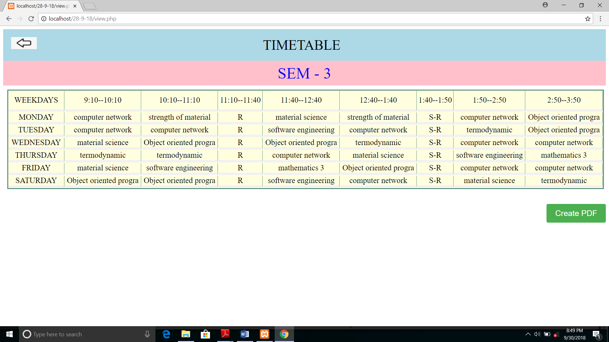

# Timetable-Generator
A PHP project developed under a 5th semester departmental course 'Minor Project'.
Includes features such as creation, modification of timetable for a department.
Generating and saving timetable as pdf using tcPDF.

Note: CREATE DATABASE OF NAME 'datatable' AND IMPORT FILE OF NAME datatable.sql INTO IT. 
AND HERE YOU ARE READY TO USE THE WEBSITE.

<ol>
  <li> FOR LOGIN AND SIGNUP
    

      
      
    

   </li>

  <li> HOME PAGE (Header with option of add SUbject/ Practical and Teacher and also access that Record)
    

    
    
    

  </li>
  <li> Fill the Subject Details and Practical details as per the Stream of the Subject)
    

    
    
    

    

       
    

  </li>
  <li> Access Edit/ Delete the Records
    

      
      
    

    

      
    

  </li>
<li> option of Generate/ Update/ View(Save) Timetable
  

    
  

</li>

<ol>
